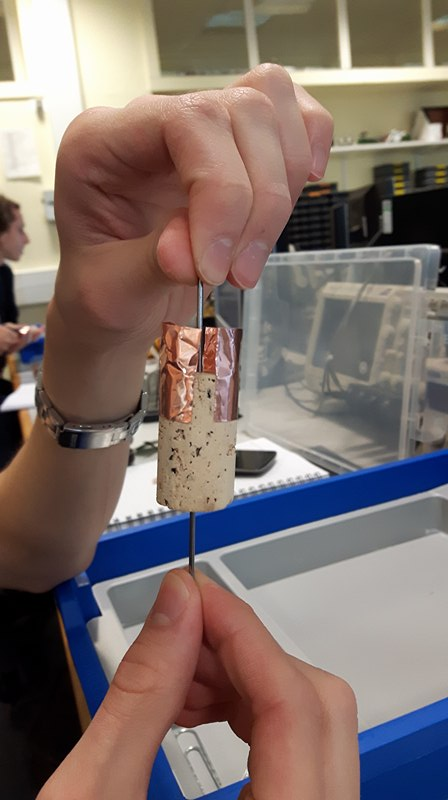

# ROCO222 coursework writeup
## DC MOTOR
Our first task was to creat a brushed DC motor using the following materials 
- Cork
- Strong magnets 
- wooden board 
- paper clips
- nail
- screws and washers
- copper wire
- copper tape

First step was was drive a nail through the centre of the cork, so it acts as a turning axis, then we had to stick copper tape on one end of the cork with gaps to form a commutator in order for the polarity of the DC electricity to be flipped. Next step was to wind copper wire around the poles of the cork to form 125 turns, which resulted in a resistance of 7.3Ω.

Then we had to mount the motor to the base, using 2 strong paper clips we bent it into a shape in order to hold the motor then secured it to the wooden board using washers and screws; additionally we used another set of clips and screws to creat a stand for the magnets to be on both sides of the motor, making sure the polarity of the magnets are opposite so they induce a magnetic field 

